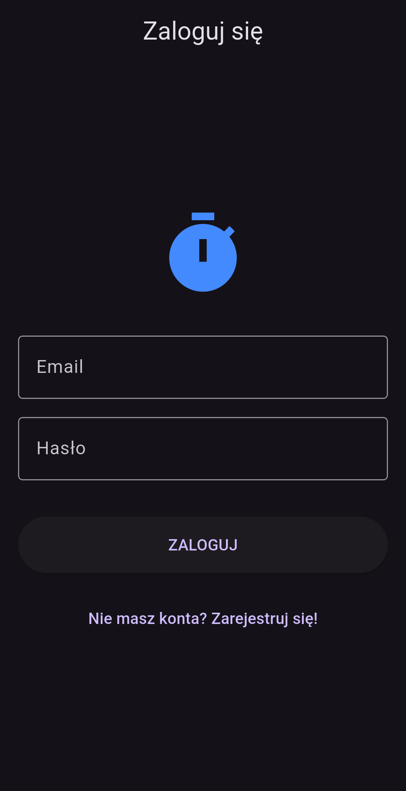
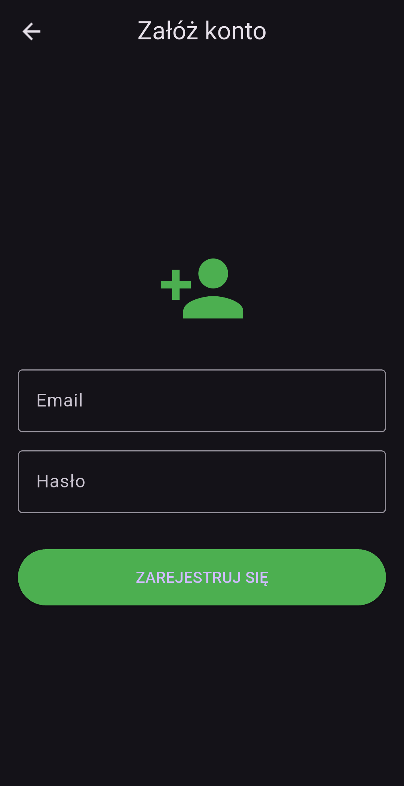
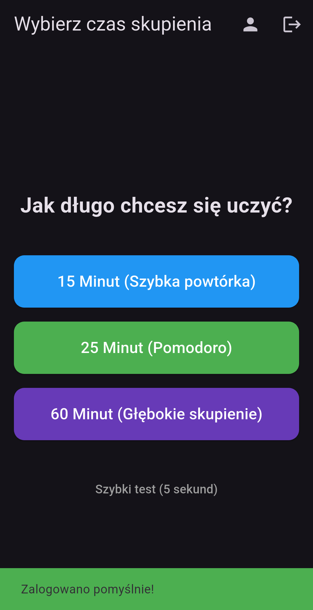
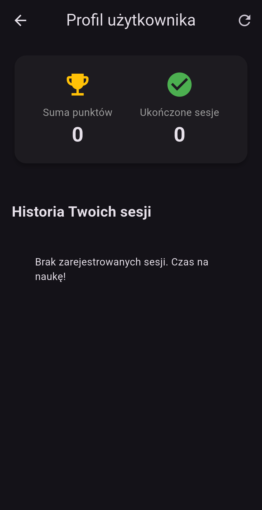
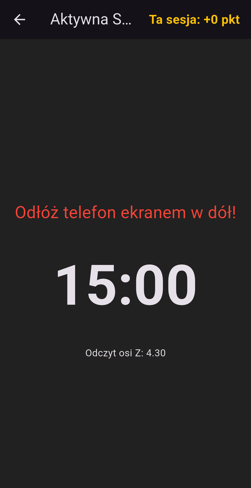
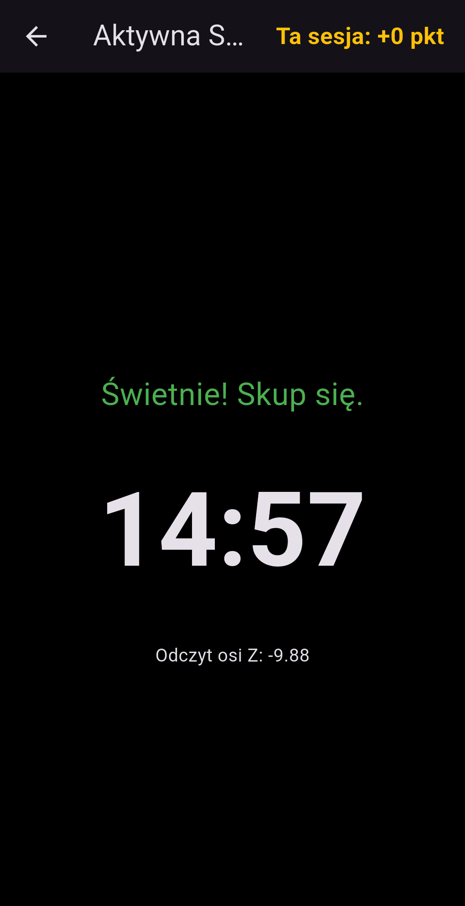

# Sklep Google Play - Karta Aplikacji

**Nazwa aplikacji:** FlipToFocus: Offline Pomodoro  
**Krótki opis:** Odłóż telefon ekranem do dołu i zacznij działać. Unikaj powiadomień, zdobywaj punkty i buduj nawyk pełnego skupienia!

**Pełny opis:** Zmagasz się z brakiem koncentracji podczas nauki lub pracy? FlipToFocus to innowacyjne narzędzie, które pomaga fizycznie odciąć się od cyfrowych rozpraszaczy. Zamiast walczyć z pokusą sprawdzania powiadomień na świecącym ekranie, nasza aplikacja promuje całkowite odłączenie. Wybierz swój cel czasowy (15, 25 lub 60 minut) i po prostu połóż telefon ekranem do dołu na blacie.

**Jak to działa?** Nasz system korzysta z wbudowanych czujników Twojego urządzenia. Gdy tylko odłożysz telefon, timer automatycznie rozpoczyna odliczanie w tle. Jeśli podniesiesz urządzenie przed upływem wyznaczonego czasu, sesja natychmiast kończy się niepowodzeniem, a Ty tracisz szansę na nagrodę!

**Główne funkcje:** * **Fizyczny wyzwalacz skupienia:** Koniec z klikaniem przycisków. Twoja produktywność zaczyna się w momencie odłożenia telefonu.
* **Grywalizacja i nagrody:** Ukończ sesje z sukcesem bez dotykania telefonu, aby zbierać punkty i śledzić swój progres.
* **Tryb Offline-First:** Brak internetu? Żaden problem. Twoje sesje są zapisywane bezpiecznie w pamięci lokalnej urządzenia i automatycznie synchronizowane z chmurą, gdy znów będziesz online.
* **Minimalistyczny design:** Brak reklam, brak zbędnych powiadomień. Czyste narzędzie do pracy głębokiej.

**Słowa kluczowe (Keywords):** pomodoro, stoper do nauki, skupienie, produktywność, adhd, timer offline, technika pomodoro, zarządzanie czasem.

---

## Polityka Prywatności

**Ostatnia aktualizacja:** 17 czerwca 2026 r.

**1. Informacje, które gromadzimy** Korzystanie z aplikacji FlipToFocus wiąże się z przetwarzaniem następujących danych:
* **Informacje o koncie:** Adres e-mail oraz bezpiecznie zaszyfrowane hasło podawane podczas procesu rejestracji, służące wyłącznie do autoryzacji w systemie.
* **Dane dotyczące użytkowania:** Czas rozpoczęcia i zakończenia sesji skupienia oraz liczba zdobytych punktów.
* **Dane z czujników urządzenia (Ważne):** Aplikacja wykorzystuje akcelerometr wbudowany w Twoje urządzenie do określania fizycznej pozycji telefonu (wykrywanie odłożenia ekranem do dołu). **Odczyty z czujników są analizowane wyłącznie lokalnie na Twoim urządzeniu.** Surowe dane pomiarowe z akcelerometru nigdy nie są przesyłane, zapisywane ani przechowywane na naszych serwerach.

**2. W jakim celu wykorzystujemy Twoje dane** Gromadzone informacje są używane wyłącznie do świadczenia i ulepszania usług aplikacji FlipToFocus:
* Do tworzenia, bezpiecznej autoryzacji i utrzymywania Twojego profilu.
* Do śledzenia Twoich postępów w skupieniu, przyznawania punktów za ukończone sesje oraz synchronizacji tych danych między Twoimi urządzeniami.

**3. Przechowywanie i bezpieczeństwo danych** Twoje dane są przechowywane na bezpiecznych serwerach. Hasła użytkowników są poddawane rygorystycznemu hashowaniu kryptograficznemu przed zapisaniem w bazie danych i nigdy nie są przechowywane w postaci jawnego tekstu. Wdrażamy branżowe standardy zabezpieczeń (m.in. tokeny JWT), aby chronić Twoje informacje przed nieautoryzowanym dostępem.

**4. Udostępnianie danych podmiotom trzecim** Zależy nam na Twoim zaufaniu. Nie sprzedajemy, nie wymieniamy ani w żaden inny sposób nie udostępniamy Twoich danych osobowych (w tym adresu e-mail) niepowiązanym podmiotom trzecim w celach reklamowych czy marketingowych.

**5. Prawa użytkownika** Jako użytkownik masz pełne prawo do wglądu w swoje dane, ich modyfikacji oraz całkowitego usunięcia. W dowolnym momencie możesz trwale usunąć swoje konto oraz całą przypisaną do niego historię postępów bezpośrednio z poziomu ustawień w aplikacji mobilnej.

**6. Kontakt** Jeśli masz jakiekolwiek pytania, wątpliwości lub sugestie dotyczące niniejszej Polityki Prywatności oraz sposobu przetwarzania Twoich danych, prosimy o kontakt z zespołem deweloperskim FlipToFocus.

---
## Materiały promocyjne (Screenshots)

