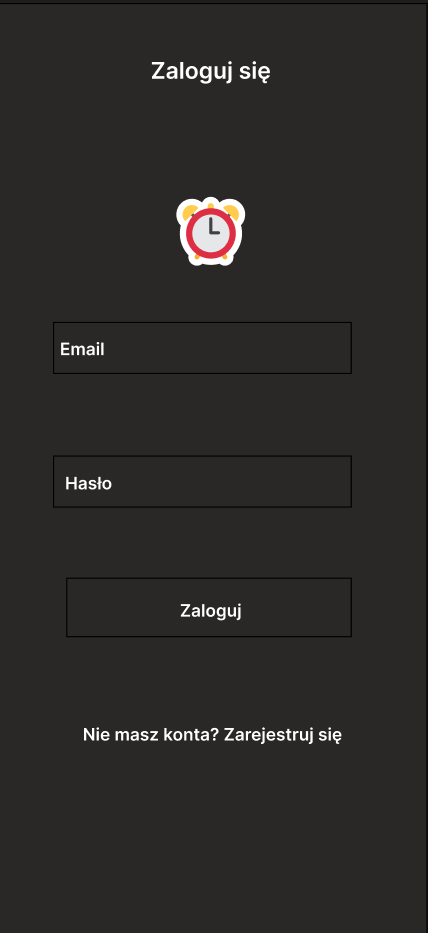
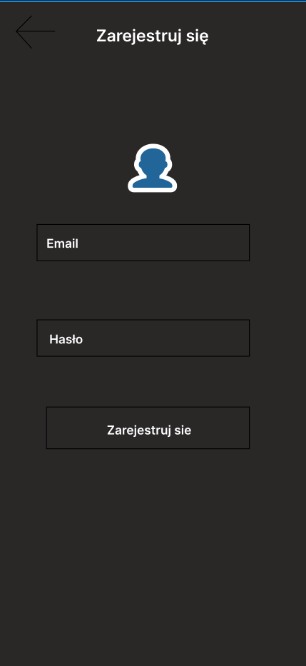
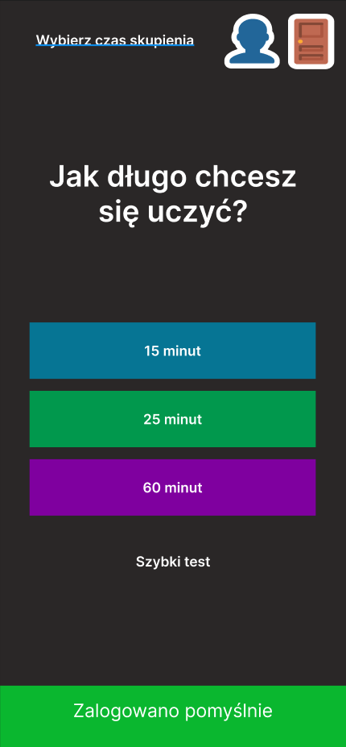
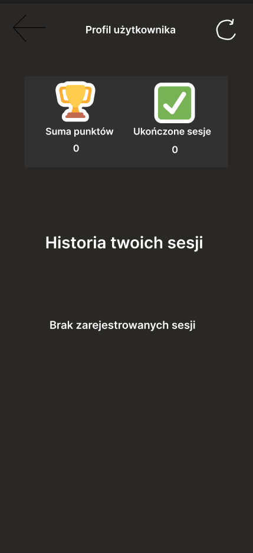
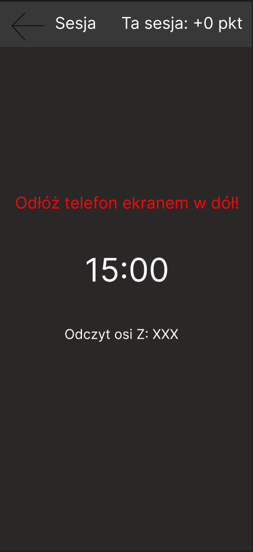
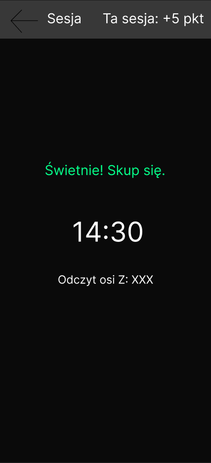

# Prototyp Mobilny i Zakres Aplikacji

## 1. Prototyp Mobilny (Wireframes & UI)
Przed przystąpieniem do prac we Flutterze, przygotowaliśmy wizualny prototyp interfejsu użytkownika uwzględniający przepływ ekranów (Login -> Wybór Czasu -> Aktywna Sesja -> Profil).

## 2. Podział: Zakres MVP (Obecny stan)
To, co zrealizowaliśmy i co jest niezbędne do działania podstawowej pętli aplikacji:
* Rejestracja i logowanie (JWT).
* Odczyt danych z akcelerometru (wykrywanie pozycji ekranem w dół).
* System timerów (15, 25, 60 minut).
* Zapisywanie sesji w lokalnej pamięci (Offline Storage).
* Przyznawanie punktów za ukończone sesje.

## 3. Podział: Dodatki (Planowany rozwój post-MVP)
Funkcje, które wykraczają poza MVP i będą dodawane w kolejnych sprintach:
* Integracja z kalendarzem Google.
* Tabela liderów (Global Leaderboard).
* Osiągnięcia i odznaki (Badges) za regularność.
* Rozbudowane statystyki kołowe (Wykresy czasu skupienia w tygodniu).